# Employee Success Analysis with SQL - NextGen Corp
<p align="center">
  
</p>

---

## Business Overview
**NextGen Corp** is a fast-growing technology company focused on delivering innovative hardware and software solutions in a highly competitive market. The organization has established a strong reputation for attracting high-caliber talent and cultivating a collaborative, performance-driven work environment that supports innovation, productivity, and sustainable growth.

As the company continues to scale, its workforce remains a critical strategic asset. NextGen Corp prioritizes employee satisfaction, fair and competitive compensation, and consistent performance excellence to retain top talent and support long-term business objectives in a rapidly evolving technology landscape.

---

## Business Problem 
Despite its continued growth and strong talent base, NextGen Corp is beginning to experience human-resource challenges that pose potential risks to long-term organizational performance. Recent internal indicators point to emerging issues across three key areas:
1. **Employee Turnover**

Variability in employee retention suggests possible dissatisfaction, increased market competition for talent, or internal operational inefficiencies. Without a clear understanding of the underlying drivers and trends, rising turnover may lead to escalating recruitment and onboarding costs, knowledge loss, and productivity gaps.

2. **Performance Variability**

Employee performance levels vary significantly across departments, limiting management’s ability to effectively allocate resources, plan promotions, and identify high-performing or underperforming teams. This lack of visibility reduces confidence in performance-based decision-making.

3. **Salary Disparities**

Concerns have emerged regarding compensation equity among employees in comparable roles. Misalignment between pay, performance, and responsibilities can contribute to reduced morale, disengagement, and increased attrition if left unaddressed.


## Project Objectives
To ensure continued success, NextGen Corp’s HR department must adopt a structured, analytical approach to workforce management. The organization needs reliable insights to:
- **Identify trends and patterns in employee retention and turnover**

Understand which departments face the highest turnover and why
- **Track and evaluate performance consistently across teams**

Highlight hhigh-performing employees, address low performance, and maintain productivity standards
- **Assess the relationship between salary and performance**

Ensure fairness, eliminate unjustified pay gaps, and support employee satisfaction

---

## Data Dictionary
- Employees Table: Contains essential employee details like name, job title, hire date, salary, performance score, attendance rate, and department affiliation
- Departments Table: Contains the list of departments within NextGen Corp. (e.g., Engineering, Sales, HR, Marketing).
- Performance Table: Tracks monthly performance scores of employees, allowing you to analyze performance trends over time.
- Attendance Table: Tracks attendance records for employees, including whether they were present or absent.
- Turnover Table: Contains data on employees who left the company, including the reason for leaving.
- Salaries Table: Provides salary data, including historical salary changes for each employee.
<p align="center">
  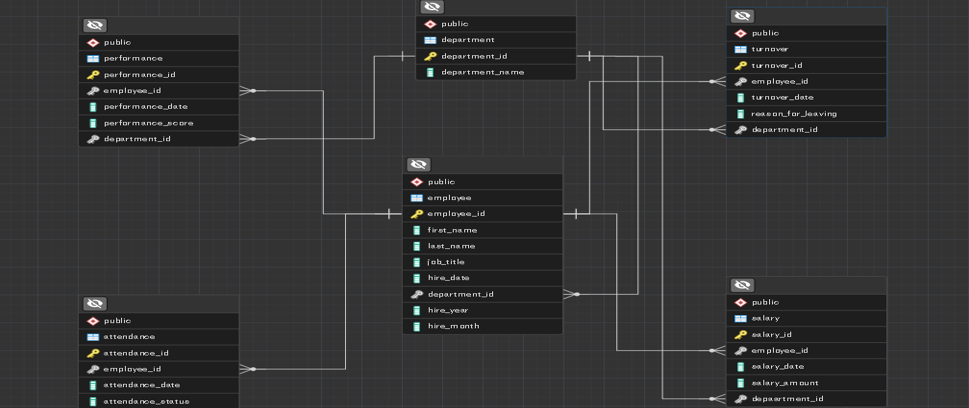
</p>

---

## Approach & Methodology
- Postgres SQL
- PgAdmin
- Queries: Select, Order By, Not In, Limit, Where, Left Join, Count, Distinct, Group by, Round, To_char, Sum, Average
- Data Analysis to identify trends and business recommendations.

---

## Employee Retention Analysis
### 1) Top 5 longest-serving employee
**Analysis & Insight:** 
- The **earliest hire date** in the company is **June 30, 2015**, meaning the longest-serving employee has been with the organization for over 9 years.
- All five longest-tenured employees were hired between **2015 and 2016**, highlighting a period of exceptionally strong retention.
- **4 out of the 5** longest-serving employees work in the **Sales department**, indicating that Sales is the most stable team in the organization.
- This suggests that the hiring practices, leadership, or incentives used during this period, particularly within Sales, were highly effective and could be replicated to improve retention across newer teams.
<p align="center">
  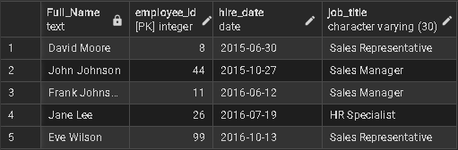
</p>
  
### 2) Rate of turnover per department
**Analysis & Insight:**
- **Engineering** is experiencing severe retention challenges with a turnover rate of **150%**, meaning more employees left than the department currently employs, a clear indicator of serious issues related to workload, leadership, or job satisfaction.
- **Marketing (64%)** and **HR (54%)** also show elevated turnover, suggesting instability and potential disengagement.
- In contrast, **Sales** has a turnover rate of just **13%**, making it the most stable department and a strong benchmark for effective people management and retention practices.
<p align="center">
  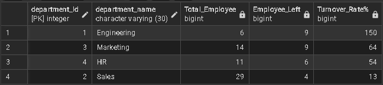
</p>

### 3) Top 3 employees at risk of leaving base on their performance
**Analysis & Insight:**
- **Grace Wilson** has the lowest average performance score at **3.43**, followed by **Jane Wilson (3.58)** and **Eve Davis (3.65)**, all below the team average.
- These lower scores indicate potential challenges with role fit, workload, or support, making these employees more vulnerable to disengagement and potential attrition.
- Without targeted intervention, their performance gaps could translate into increased turnover risk and lost productivity.
<p align="center">
  
</p>

### 4) Top reasons why employees are leaving 
**Analysis & Insight:**
- The most common reason for employee departures is **personal reasons (11 exits)**, indicating a need for more flexible working arrangements and stronger employee support.
- **7** employees left for other **job opportunities**, suggesting competitive pressures related to pay, engagement, or career development.
- **Career growth limitations (5 exits)** and **retirements (5 exits)** also contribute meaningfully to turnover, highlighting gaps in progression planning and succession management.
<p align="center">
  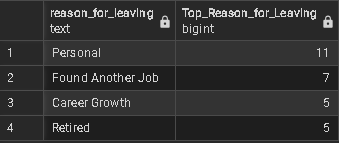
</p>

### 5) Number of employees that left 
**Analysis & Insight:**
- A total of **28 employee separations** indicates a meaningful level of turnover that is likely impacting productivity, team continuity, and recruitment costs.
- When combined with department-level data, this volume of exits highlights particularly strong retention challenges within **Engineering, Marketing, and HR,** reinforcing the need for targeted engagement and retention strategies.
<p align="center">
  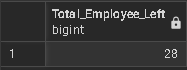
</p>

---

## Employee Performance Analysis
### 1) Number of employees with a performance score of 5.0
**Analysis & Insight:** 
- No employee achieved the maximum performance score of **5.0**, indicating that **top-tier performance is not currently being reached** across the organization.
- This suggests potential gaps in performance expectations, goal clarity, training, or employee support, which may be limiting overall productivity and engagement.
<p align="center">
  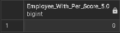
</p>
  
### 2) Number of employees with a performance score below 3.5
**Analysis & Insight:**
- Only **one employee** has an average performance score **below 3.5**, indicating an early performance risk.
- While limited in scale, this outlier could signal potential disengagement or skill gaps that, if left unaddressed, may impact productivity and increase the likelihood of future turnover.
<p align="center">
  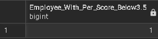
</p>

### 3) Department with the most employees, with a performance of 5.0
**Analysis & Insight:**
- No department achieved an average performance score of **5.0**, indicating that **top-tier performance is not being reached at the team level**.
- While individual employees may perform well, the lack of consistently high departmental averages suggests potential gaps in team alignment, KPI clarity, training, or leadership effectiveness
<p align="center">
  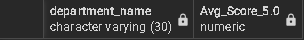
</p>

### 4) Department with the most employees with a performance score below 3.5 
**Analysis & Insight:**
- No department has an average performance score below **3.5**, indicating that **performance challenges are not systemic** and are largely limited to individual employees rather than entire teams.
- This suggests that departmental leadership, training, and operational structures are generally effective and support consistent performance across the organization.
<p align="center">
  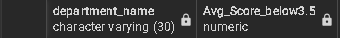
</p>

### 5) Average performance score by department
**Analysis & Insight:**
- Departmental performance is highly consistent, with average scores ranging from **4.00 to 4.13**, indicating stable and balanced team performance across the organization.
- **Marketing** leads slightly within this range, suggesting effective practices that could be shared across other teams, while **Sales**, at the lower end, may benefit from additional support such as clearer KPIs, updated tools, or refresher training.
<p align="center">
  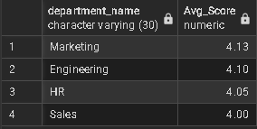
</p>

---

## Salary Analysis
### 1) Total salary expense of NextGen Corp
**Analysis & Insight:** 
- NextGen Corp’s total salary expenditure is **$4,850,000**, representing a significant investment in its workforce and the company’s highest ongoing operational cost.
- Given the scale of this spend, even small improvements in **retention, performance, or compensation alignment** can generate substantial financial impact and improve overall return on investment in human capital.
<p align="center">
  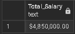
</p>
  
### 2) Average salary by job title
**Analysis & Insight:**
- The **Sales Representative** role has the highest average salary at **$84,285.71**, reflecting strong revenue-driven incentives and the importance of frontline sales performance.
- **HR Specialists** follow closely at **$81,818.18**, highlighting the company’s investment in talent management and employee relations.
- Both **Engineers** and **Sales Managers** earn an average of **$80,000**, showing parity between technical expertise and sales leadership.
- **Marketing Specialists** have the lowest average at **$77,857.14**, indicating competitive but comparatively lower compensation within the organization.
<p align="center">
  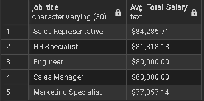
</p>

### 3) How many employees earn above $80,000
**Analysis & Insight:**
- A total of **26 employees** earn more than **$80,000**, indicating a strong concentration of senior, specialized, and high-impact roles within NextGen Corp.
- This reflects a **competitive compensation structure** designed to attract and retain top talent in critical functions such as sales, engineering, and HR leadership.
<p align="center">
  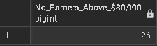
</p>

### 4) How does performance correlate with salary across departments 
**Analysis & Insight:**
- **Marketing** has the highest total salary spend at **$253.9M** and also the highest average performance score **(4.13)**, indicating a strong return on compensation investment.
- **Engineering** delivers the second-highest performance **(4.10)** with a significantly lower salary cost **($192M)**, making it one of the most cost-efficient teams.
- **HR** maintains solid performance **(4.05)** with a low total salary of **$49.8M**, reflecting efficient workforce management.
- **Sales**, with a salary cost of **$24.36M** and the lowest performance score **(4.00)**, shows the greatest opportunity for performance improvement through enhanced training, incentives, or tools.
<p align="center">
  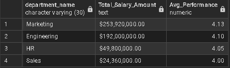
</p>

---

## Recommendations
### Employee Experience & Engagement
1. **Enhance Employee Support Programs**

Offer wellness initiatives, stress management resources, family-care policies, and flexible schedules to reduce personal-life attrition.

2. **Build a Positive Culture of Recognition**

Introduce employee appreciation programs, spotlight achievements, and award exceptional contributions to boost morale.

3. **Improve Internal Mobility**

Allow employees to move across teams or departments before seeking external opportunities.

4. **Create Employee Listening Channels**

Quarterly surveys, HR open-door policies, and manager check-ins to address issues early.

### Performance Management
1. **Standardize Performance Evaluation**

Implement consistent, bias-free performance criteria across all departments to ensure fair and reliable assessments.

2. **Support Low Performers Early**

Provide targeted coaching for employees with performance scores below 3.5, supported by clear improvement plans and measurable milestones.

3. **Build a High-Performance Culture**

Introduce department-level KPIs, expand coaching programs, and offer continuous upskilling to move average performance closer to top-tier benchmarks.

4. **Establish Performance-Based Rewards**

Introduce bonuses, recognition programs, and leadership opportunities to motivate high performers and reinforce strong performance trends.

### Turnover & Retention
1. **Targeted Departments Support**

Engineering, HR, and Marketing show high turnover; prioritize these departments for retention programs, workload assessments, and leadership coaching.

2. **Exit Interview Insights**

Formalize structured exit interviews to uncover root causes behind personal reasons, career growth gaps, and employees finding better jobs.

 3. **Reduce Personal-Reason Turnover**

Offer flexible work arrangements, improved leave policies, and wellness support to address personal-life–related exits.

4. **Strengthen Career Development**

Many employees left for “career growth”; create clearer promotion pathways, mentorship programs, and skill development plans.

### Salary & Compensation
1. **Conduct salary benchmarking**

Compare current salaries with industry standards to ensure competitiveness across all roles, especially marketing specialists and technical roles (engineers).

2. **Review compensation alignment**

Align salary levels with job responsibilities and performance outcomes to maintain fairness and prevent pay inequities.

3. **Strengthen incentive structures**

Maintain strong incentives for sales roles and consider performance-based bonuses for marketing, engineering, and HR to boost motivation.

4. **Build a clear salary progression framework**

Implement transparent salary ranges and growth paths so employees understand how performance and tenure lead to pay increases.

---

### Department-specific Recommendations
1. **Engineering (critical attention needed)**
- Address causes of 150% turnover: conduct workload audits, enhance leadership support, and improve team morale.
- Offer technical training and recognition programs to boost satisfaction.
2. **Marketing & HR (high turnover areas)**
- Strengthen employee support and engagement.
- Clarify role expectations, career paths, and growth opportunities.
- Reassess workload distribution and team structure.
3. **Sales (strong retention & stability)**
- Analyze and document sales’ successful retention strategies, leadership style, incentives, onboarding, and replicate what works across other departments.
4. **Company-wide**
- Ensure each department receives a tailored retention and performance plan based on turnover rate and average performance score.


## Executive Summary
This report provides a comprehensive analysis of employee performance, compensation, and turnover patterns at NextGen Corp, offering data-driven insights essential for strengthening workforce stability and organizational growth. The findings reveal critical retention challenges in Engineering, HR, and Marketing, balanced by strong stability in Sales. Performance levels across departments are generally consistent, though no department has reached top-tier performance scores, indicating opportunities for enhanced development and clearer evaluation standards. 
Salary analysis highlights uneven compensation distribution across roles, suggesting the need for improved alignment with responsibilities and market benchmarks. Based on these insights, the report recommends targeted retention strategies, standardized performance management, competitive and equitable compensation structures, and improved employee support systems. 
Implementing these recommendations will enable NextGen Corp to optimize employee retention, enhance productivity, and build a more resilient, high-performing workforce.


---

## Tech Stack
- **Tools:** Excel, SQL, Python (Pandas), Power BI/Tableau (optional)
- **Libraries:** Pandas, NumPy, Matplotlib

---

## How to Run (Optional)
```bash
pip install -r requirements.txt
